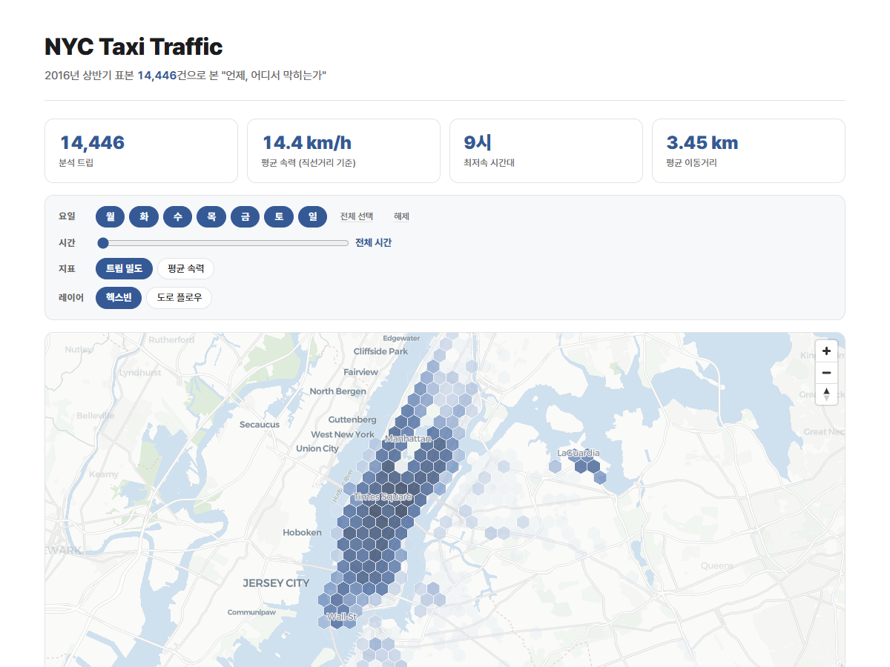

# NYC Taxi Traffic — 언제, 어디서 막히는가

NYC 택시 운행 데이터로 "언제, 어디서 막히는가"에 답하는 인터랙티브 대시보드. 서버 없이 정적 파일만으로 동작.

**Live: https://hollyriver.github.io/NYCTaxiDash/**



> 화면은 지도·차트·KPI만 한 화면(스크롤 없음)에 담는다. 관찰·데이터 정제 기준·한계 등 해설은 모두 이 문서가 정본.

## 무엇을 보여주는가

핵심 질문은 두 가지 — **언제 막히는가**(요일 × 시간), **어디서 막히는가**(위치 × 도로). 서로 다른 두 지도 레이어가 이를 분업.

| 레이어 | 인터랙션 범위 | 방식 |
|---|---|---|
| **헥스빈 히트맵** (~240m 셀) | 요일 멀티선택 × 시간 슬라이더 — 전 조합 | 원본 전량(슬림 JSON)을 브라우저에서 실시간 재집계 |
| **도로 플로우 지도** | 주중/주말 × 시간대 4구간(새벽/오전/오후/저녁) — 8슬라이스 | osmnx 최단경로 14,339건을 빌드 타임에 사전 집계 |

- 헥스빈 히트맵은 이용 밀도 / 평균 속력 표시 전환 가능, 표본 5건 미만 셀은 반투명 처리. 밀도 색상 스케일은 선택된 요일·시간 슬라이스의 분위수(p50/p85/p98)로 매번 동적 구성 — 희소 선택에서도 대비 유지. 평균 속력은 정체(저속)일수록 검붉게 표현
- 도로 플로우는 **선 굵기 = 통행량(n), 색 = 세그먼트 평균 속력(정체 정도)** 로 두 지표를 분리 표현. 색은 속력 기준 고정 램프로 느릴수록 검붉게(정체) → 빠를수록 초록(원활) — 넓은 간선은 통행이 많아 굵어도 안 막히면 초록으로 표시됨. 굵기·투명도는 슬라이스별 통행량 분위수로 동적 구성. 플로우 시간대(밴드) 선택 시 해당 시간 트립만으로 KPI·히스토그램 강조가 갱신됨
- Plotly 차트 2종: 요일×시간 평균 속력 히트맵(전역), 시간대별 트립 수(선택 요일 연동)

## 주요 관찰

- **오후 3시가 가장 느리다** — 시간대 평균 속력 최저 14.4 km/h로 오전 9시(14.5 km/h)와 사실상 동률. 출근 피크만큼 오후 중반도 막힌다는 뜻이며, 최고인 새벽 5시(30.0 km/h)의 절반 이하. 심야(0–5시) 23.4 km/h vs 주간(8–18시) 15.2 km/h.
- **트립은 퇴근길에 몰린다** — 18시 912건, 19시 903건으로 피크. 최저인 새벽 5시(150건)의 약 6배. 화면의 시간대별 트립 수 차트에서 그대로 확인 가능.
- **주말이 주중보다 빠르다** — 주말 18.9 km/h vs 주중 17.0 km/h (+1.9 km/h). 주말의 심야 0–2시 트립 비중(14.2%, 주중 5.5%의 2.6배)이 평균을 끌어올린 몫도 있음.
- **장거리 트립은 고속도로 효과** — 도로망 거리 상위 10%(9.0 km 이상, 평균 15.4 km)의 평균 속력 29.4 km/h로 나머지(16.2 km/h)의 약 1.8배. 이 중 25.0%는 JFK, 35.5%는 라과디아 공항행 — 도로 플로우 레이어에서 공항 방면 간선이 굵게 잡히는 이유.

## 데이터와 정제 기준

[Kaggle NYC Taxi Trip Duration](https://www.kaggle.com/c/nyc-taxi-trip-duration) 데이터의 표본 14,587건(2016-01~2016-06). 원본 CSV(`data/NYCTaxi.csv`)는 리포지토리에 동봉.

정제 후 **14,446건** 사용 (141건 제거):

- NYC 대역 밖 좌표 (BBOX: 위도 40.50–41.00, 경도 -74.30~-73.60)
- 소요시간 60초 미만
- 직선거리 0.05 km 이하 또는 60 km 초과
- 직선거리 기준 평균 속력 120 km/h 초과

속력·거리 지표는 **OSM 도로망 최단경로 길이 기준**(14,446건 중 라우팅 성공 14,339건). 미라우팅 107건은 직선거리 기준 유지. 평균 속력 17.5 km/h, 평균 이동거리 4.18 km.

## 한계

1. **속력은 하한 추정치** — 도로망 최단경로 길이 / 소요시간 기준. 최단경로는 실주행 경로보다 짧거나 같으므로 실제 속력은 이보다 높을 수 있음.
2. **최단경로 ≠ 실주행 경로** — 도로 플로우는 OSM 도로망 최단경로로 추정한 것이며 기사가 실제 택한 경로가 아님.
3. **세그먼트 속도는 근사치** — 플로우 색으로 쓰는 세그먼트 평균 속력은 그 도로를 지난 트립들의 전체 평균 속력(트립 전체 구간 기준)이며, 그 구간을 실제로 통과한 속도가 아님.
4. **2016년 표본** — 현재 교통 상황과 다를 수 있음.

## 빌드 방법

빌드 산출물(`docs/data/`)이 커밋되어 있어 재빌드 없이 바로 서빙 가능.

```bash
# 헥스빈용 트립 데이터 (trips.json, meta.json)
pip install pandas numpy
python scripts/build_data.py

# 도로 플로우 8슬라이스 (flow_*.geojson) — OSM 다운로드로 수 분 소요
pip install osmnx scikit-learn
python scripts/build_flows.py

# 테스트
python -m pytest tests/

# 로컬 서빙
python -m http.server 8000 --directory docs
```

## 제작 노트

Claude Code와의 페어링(바이브 코딩)으로 설계부터 배포까지 진행.

**스택** — 빌드 타임: Python(pandas, osmnx) / 프론트: MapLibre GL, Plotly.js, 바닐라 JS 정적 사이트 (서버·번들러 없음) / 배포: GitHub Pages
